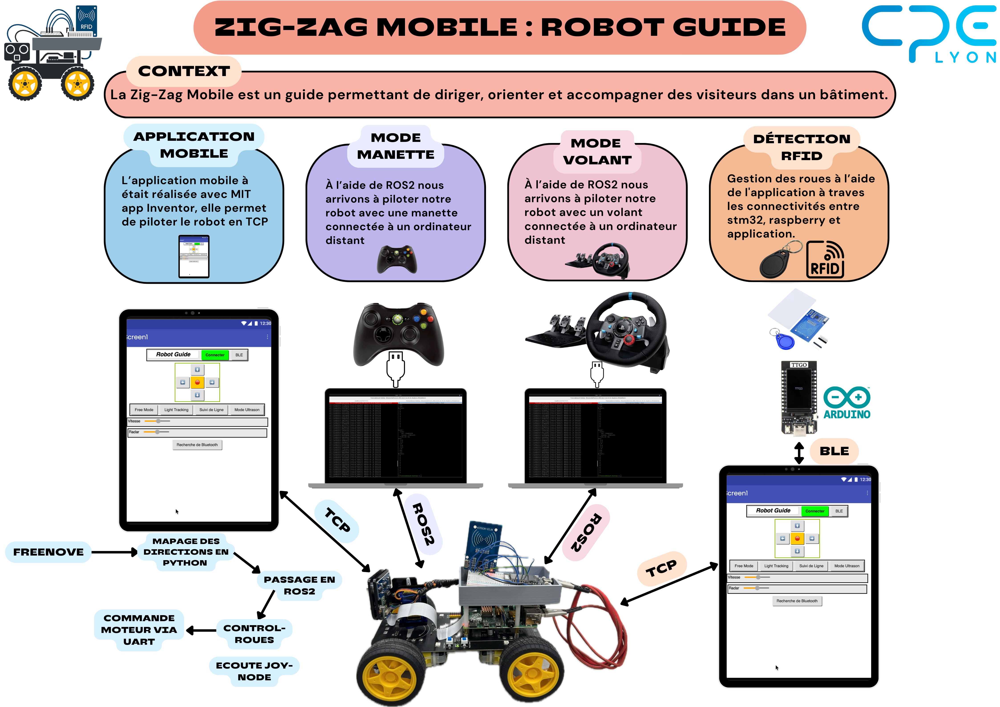
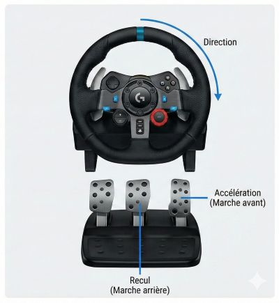
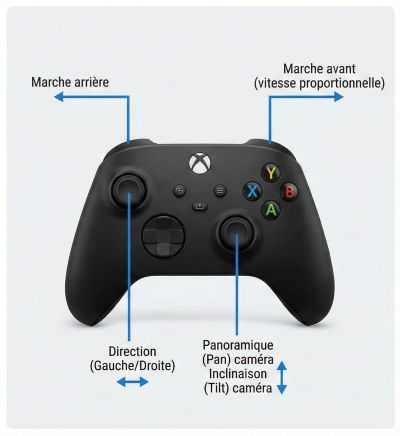
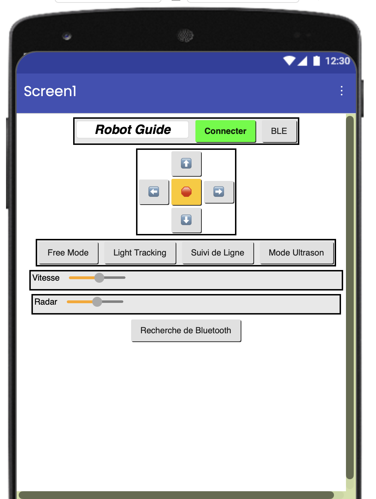
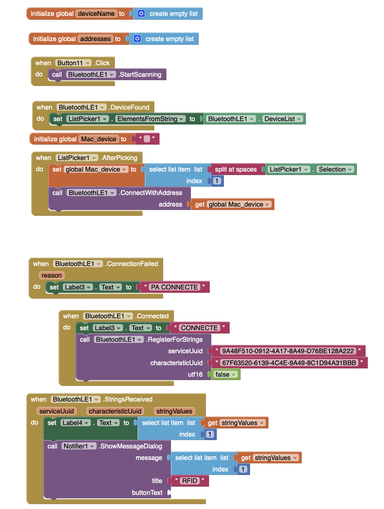
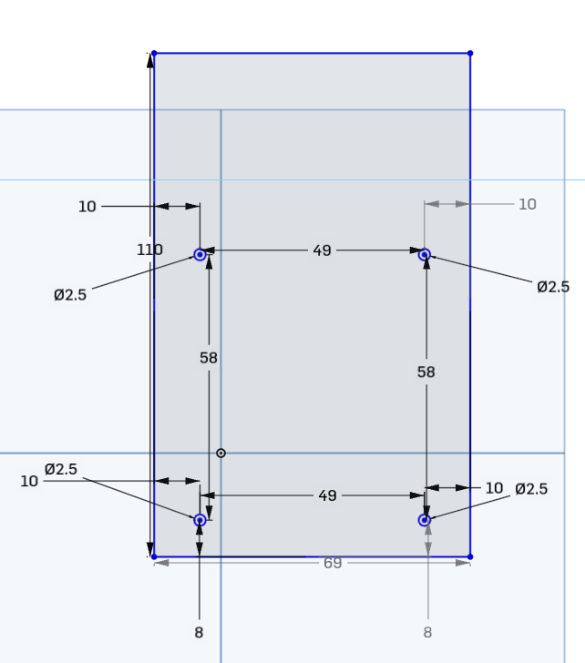
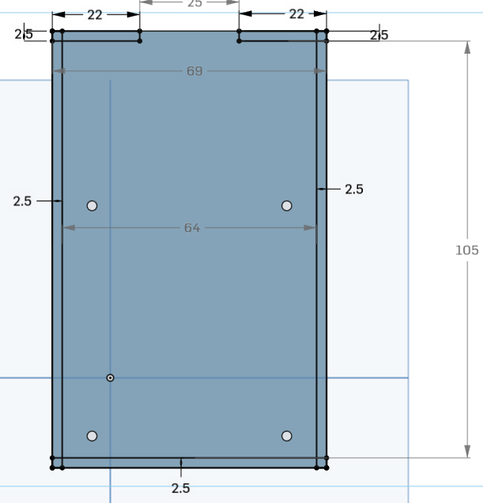
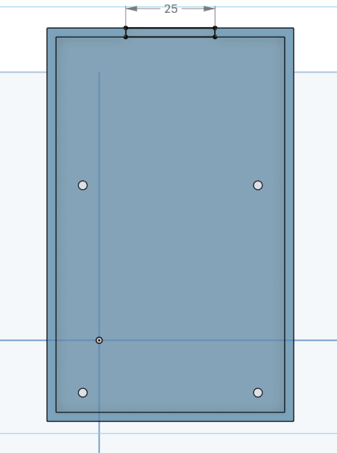

# Prototypage : Projet Robot Guide

**Auteurs** : Lucy SAINT-AURET, Nadim BEN HASSEN  
**Date de début** : 19/11/2025  
**Date de fin** : 09/12/2025  
**Professeur encadrant** : Sébastien ALTOUNIAN  
**École** : CPE Lyon  
**Module** : Capteurs/Actionneurs et Prototypes  

> [!CAUTION]
> **Vidéo de présentation du projet** : https://youtu.be/PVKF8hJmzf0
>

> [!TIP]
>Voici le Poster de notre projet : 


## Sommaire 

- [Prototypage : Projet Robot Guide](#prototypage--projet-robot-guide)
  - [Sommaire](#sommaire)
  - [Déplacement avec la manette (ROS2)](#déplacement-avec-la-manette-ros2)
    - [1. Contrôle via Volant et Pédales (Logitech)](#1-contrôle-via-volant-et-pédales-logitech)
    - [2. Contrôle via Manette (Xbox)](#2-contrôle-via-manette-xbox)
    - [Fonctionnement technique](#fonctionnement-technique)
    - [Procédure de lancement](#procédure-de-lancement)
      - [1. Configuration Réseau](#1-configuration-réseau)
      - [2. Connexion SSH](#2-connexion-ssh)
      - [3. Exécution des nœuds](#3-exécution-des-nœuds)
  - [Déplacement avec l'application (communication TCP)](#déplacement-avec-lapplication-communication-tcp)
    - [Connection au Robot](#connection-au-robot)
    - [Fonctionnement général](#fonctionnement-général)
    - [Commandes utilisées](#commandes-utilisées)
    - [Fonctionnement dans l’application](#fonctionnement-dans-lapplication)
    - [Résultat](#résultat)
  - [Bluetooth Low Energy (BLE)](#bluetooth-low-energy-ble)
    - [Fonctionnement général](#fonctionnement-général-1)
    - [Structure des blocs MIT App Inventor](#structure-des-blocs-mit-app-inventor)
    - [Résultat](#résultat-1)
  - [RFID](#rfid)
    - [Câblage utilisé dans ce projet](#câblage-utilisé-dans-ce-projet)
      - [TTGO T-Display (ESP32 V1.1) → RC522](#ttgo-t-display-esp32-v11--rc522)
    - [Principe de fonctionnement](#principe-de-fonctionnement)
    - [Exemple de sortie console](#exemple-de-sortie-console)
    - [Affichage sur écran](#affichage-sur-écran)
    - [Dépendances](#dépendances)
  - [Impression 3D](#impression-3d)
    - [Modélisation Paramétrique (Onshape)](#modélisation-paramétrique-onshape)
    - [Exportation et Maillage](#exportation-et-maillage)
    - [Préparation à l'impression (Slicer Cura)](#préparation-à-limpression-slicer-cura)


## Déplacement avec la manette (ROS2)

Le pilotage manuel du robot Freenove est assuré par des nœuds ROS2 abonnés au topic `/joy`. Ces nœuds convertissent les commandes brutes d'un contrôleur de jeu en signaux PWM pour les moteurs du robot.

Nous avons développé deux scripts distincts pour s'adapter à différents périphériques d'entrée :

### 1. Contrôle via Volant et Pédales (Logitech)

**Fichier :** [`control_roues.py`](/proto_ws/src/prototypage/prototypage/control_roues.py)

Ce script est conçu pour une expérience de conduite réaliste utilisant un volant et un pédalier (type Logitech). Il interprète les axes spécifiques des pédales pour l'accélération et le freinage.

* **Accélération (Marche avant) :** Pédale d'accélérateur (Axe `Throttle`). La vitesse est proportionnelle à la pression exercée.
* **Recul (Marche arrière) :** Pédale de frein (Axe `Break`).
* **Direction :** Volant (Axe horizontal).
  * Le script implémente une **direction différentielle** : tourner le volant réduit la vitesse des roues intérieures au virage (gauche ou droite) pour permettre une rotation fluide tout en avançant.
  * Une *deadzone* (zone morte) est appliquée pour éviter les mouvements involontaires lorsque le volant est centré.
* **Rotation sur place :** Si aucune pédale n'est enfoncée, tourner le volant permet de faire pivoter le robot sur lui-même.



### 2. Contrôle via Manette (Xbox)

**Fichier :** [`control_roues_manette.py`](/proto_ws/src/prototypage/prototypage/control_roues_manette.py)

Ce script permet un contrôle plus complet, incluant la gestion de la caméra embarquée (Pan/Tilt) grâce aux nombreux axes disponibles sur une manette de jeu standard.

* **Déplacement du robot :**
  * **Gâchette RT (Right Trigger) :** Marche avant (vitesse proportionnelle).
  * **Gâchette LT (Left Trigger) :** Marche arrière.
  * **Joystick Gauche :** Direction (Gauche/Droite). Comme pour le volant, cela applique une vitesse différentielle aux moteurs.
* **Contrôle de la Caméra (Servomoteurs) :**
  * **Joystick Droit (Horizontal) :** Contrôle le panoramique (Pan) de la caméra.
  * **Joystick Droit (Vertical) :** Contrôle l'inclinaison (Tilt) de la caméra.
  * Le script pilote directement le module PCA9685 pour orienter la caméra en temps réel.



### Fonctionnement technique

Les deux scripts fonctionnent selon la logique suivante :
1. **Abonnement ROS2 :** Le nœud écoute les messages de type `sensor_msgs/msg/Joy` sur le topic `/joy`.
2. **Mapping :** Les valeurs des axes (-1.0 à 1.0) sont normalisées et converties en puissance moteur (PWM).
3. **Logique de mixage :** L'algorithme combine la valeur de "Poussée" (Avancer/Reculer) et la valeur de "Rotation" pour calculer la vitesse indépendante des roues gauches et droites (`setMotorModel`).
4. **Sécurité :** Une zone morte (*deadzone*) est configurée pour les triggers et les joysticks afin d'éviter le bruit du capteur à l'arrêt.

### Procédure de lancement

Pour contrôler le robot, une communication réseau est nécessaire entre le PC (où est branchée la manette) et la Raspberry Pi (qui contrôle les moteurs). Voici la procédure étape par étape :

#### 1. Configuration Réseau

* Assurez-vous que le **PC** et la **Raspberry Pi** sont connectés au **même réseau Wi-Fi**.
* **Configuration ROS2 (Important) :** Pour autoriser la communication entre les deux machines, la variable d'environnement `ROS_LOCALHOST_ONLY` doit être désactivée.
    * Ouvrez le fichier `.bashrc` sur le **PC** et sur la **Raspberry Pi**.
    * Assurez-vous que la ligne suivante est présente (ou modifiez-la) :
        ```bash
        export ROS_LOCALHOST_ONLY=0
        ```
    * Sauvegardez et rechargez le fichier (`source ~/.bashrc`) ou ouvrez de nouveaux terminaux.

#### 2. Connexion SSH

Connectez-vous à la Raspberry Pi du robot depuis un terminal sur votre PC :

```bash
ssh freenove@192.168.1.112
```
**Mot de passe** : Rob4student

#### 3. Exécution des nœuds

Il est nécessaire d'avoir deux terminaux ouverts pour lancer la chaîne de contrôle complète.

Tout d'abord, il faut faut sourcer le terminal avec :
```bash
cd ~/proto_w/
source /opt/ros/humble/setup.bash
```

Puis build avec la commande suivante : 
```bash
colcon build
```

Puis de nouveau sourcer avec : 
```bash 
source install/setup.bash
```

* Terminal 1 (Sur le PC) - Gestion de la manette : Lancez le nœud ROS2 qui récupère les inputs de la manette/volant.
  
    ```Bash
    ros2 run joy joy_node
    ```

* Terminal 2 (SSH Raspberry Pi) - Contrôle des roues : Lancez le script Python correspondant au périphérique que vous utilisez (Volant ou Manette Xbox).
    ```Bash
    ros2 run prototypage control_roues.py
    ```


## Déplacement avec l'application (communication TCP)

Cette application permet de piloter un robot ESP32 depuis un smartphone en envoyant des commandes texte via TCP ou BLE.
Chaque bouton et chaque slider génère une commande interprétée en temps réel par le robot.

----------------------------------------------------

### Connection au Robot

Pour connecter l'application au robot, il faut : 
```Bash
    cd Freenove_4WD_Smart_Car_Kit_for_Raspberry_Pi-master
    cd Code
    cd Server
    sudo python main.py
```
Puis après lancer l'application et cliquer sur le bouton connecter en vert


### Fonctionnement général

L’interface contient :
- des boutons directionnels (avant, arrière, gauche, droite, stop),
- des boutons pour les différents modes automatiques,
- un slider pour régler la vitesse des moteurs,
- un slider pour orienter le servo,
- un bouton pour établir la connexion.

Chaque interaction produit une commande texte (ex : CMD_MOTOR#50#50#50#50) envoyée directement au robot.

----------------------------------------------------

### Commandes utilisées

1) Commandes moteur  
Format :  
CMD_MOTOR#V1#V2#V3#V4

Exemples :  
- Avancer : CMD_MOTOR#50#50#50#50  
- Reculer : CMD_MOTOR#-50#-50#-50#-50  
- Tourner gauche : CMD_MOTOR#-50#50#-50#50  
- Tourner droite : CMD_MOTOR#50#-50#50#-50  
- Stop : CMD_MOTOR#0#0#0#0  

2) Commande du servo  
Format :  
CMD_SERVO#1#ANGLE  
Exemple : CMD_SERVO#1#90  

3) Commandes de modes automatiques  
CMD_MODE#1 → Mode manuel  
CMD_MODE#2 → Free mode  
CMD_MODE#3 → Suivi de ligne  
CMD_MODE#4 → Mode ultrason  

----------------------------------------------------

### Fonctionnement dans l’application

1. Le bouton Connecter établit la liaison TCP ou BLE.  
2. Les boutons directionnels envoient immédiatement la commande moteur associée.  
3. Le slider vitesse modifie les valeurs envoyées aux moteurs.  
4. Le slider servo envoie automatiquement CMD_SERVO#1#ANGLE à chaque mouvement.  
5. Les boutons de mode envoient la commande CMD_MODE correspondante.  
6. Le bouton STOP envoie CMD_MOTOR#0#0#0#0.

----------------------------------------------------

### Résultat

L’application offre :
- un pilotage fluide et réactif,
- un contrôle précis de la vitesse,
- la gestion du servo,
- l’accès aux modes autonomes du robot.

Cette interface MIT App Inventor rend le contrôle du robot simple, intuitif et entièrement compatible avec l’ESP32.

## Bluetooth Low Energy (BLE)

Cette fonctionalitée permet de connecter une application MIT App Inventor à un ESP32 équipé d’un lecteur RFID.  
L’ESP32 envoie l’UID des cartes RFID via BLE grâce à une caractéristique configurée en mode NOTIFY.

### Fonctionnement général
- L’ESP32 agit comme serveur BLE sous le nom **ESP32_RFID**.
- Il expose un service BLE et une caractéristique qui transmet automatiquement chaque UID détecté.
- L’application MIT App Inventor scanne, détecte, puis se connecte à ce serveur BLE.
- Une fois connecté, l’app s’enregistre pour recevoir les notifications et affiche l’UID envoyé.

### Structure des blocs MIT App Inventor
1. **Scan BLE**
   - Un bouton démarre le scan.
   - L’événement `DeviceFound` récupère la liste des appareils et l’affiche dans un ListPicker.

2. **Sélection et connexion**
   - L’utilisateur choisit un appareil BLE.
   - L’adresse MAC est extraite de la sélection.
   - App Inventor tente la connexion via `ConnectWithAddress`.

3. **Gestion d'état**
   - `Connected` met à jour une étiquette indiquant la réussite de la connexion.
   - `ConnectionFailed` affiche une erreur si l’app ne parvient pas à se connecter.

4. **Réception des données**
   - À la connexion, l’app s’enregistre sur la caractéristique BLE via `RegisterForStrings`.
   - L’événement `StringsReceived` récupère l’UID envoyé depuis l’ESP32.
   - L’UID est affiché dans un Label et dans une boîte de dialogue Notifier.
  
Voici une image des différents bloques utilisés : 

### Résultat
L’application peut maintenant :
- détecter l’ESP32 BLE,
- s’y connecter,
- recevoir automatiquement les UID RFID,
- les afficher à l’écran.

Ce workflow permet une communication BLE simple et efficace entre l’ESP32 et une interface mobile construite avec MIT App Inventor.

## RFID

Le code est disponible ici [RFID.ino](RFID.ino)

nous utilisons une **carte TTGO T-Display ESP32** équipée d’un écran couleur IPS 1.14"  
pour afficher en temps réel l’UID d’un badge RFID/MIFARE lu par un **module RC522**.

Le programme initialise :

- l’écran TFT (ST7789V)
- le lecteur RFID RC522 via l’interface SPI
- et affiche l’UID de chaque carte présentée.

Le moniteur série affiche également les informations détaillées (debug SPI + UID).


---

###  Câblage utilisé dans ce projet

####  TTGO T-Display (ESP32 V1.1) → RC522

| RC522 | TTGO Pin |
|-------|----------|
| **VCC** | 3.3V |
| **GND** | GND |
| **SDA (SS)** | GPIO27 *(ou GPIO4 selon configuration)* |
| **RST** | GPIO32 *(ou GPIO15 selon configuration)* |
| **MOSI** | GPIO21 |
| **MISO** | GPIO16 *(ou GPIO17)* |
| **SCK** | GPIO12 *(SPI remappé)* |

> Ce câblage utilise un bus SPI **reconfiguré manuellement**  
> car le SPI matériel (GPIO 18/19/23/5/16) est réservé à l’écran.

---

###  Principe de fonctionnement

1. Initialisation du moniteur série (debug 115200 baud)  
2. Configuration du SPI sur des GPIO alternatifs  
3. Initialisation du lecteur RFID RC522  
4. Boost de l’antenne RFID  
5. Initialisation de l’écran TFT  
6. Boucle de lecture :  
   - Détection d’une carte  
   - Lecture de l’UID  
   - Affichage dans le terminal  
   - Affichage sur l’écran LCD

---

###  Exemple de sortie console

    === SYSTEME RFID TTGO DEBUG ===
    Initialisation SPI avec:
    SCK=12
    MOSI=21
    MISO=16
    SS=4
    RST=15
    Init RFID...
    Version RFID detectee: 0x92
    Antenne boostee !
    RFID Ready!
    Scan...
    Card present!
    UID: 3A 9F 8B C2 

---

###  Affichage sur écran

Lorsque la carte est détectée, l’écran affiche :

    Carte détectée !
    3A 9F 8B C2

Puis revient à l’invite :

    Approche une carte...

---

###  Dépendances

À installer dans l’Arduino IDE :

- **MFRC522** (Miguel Balboa)
- **TFT_eSPI**
- **SPI**
- **ESP32 Board Support**

## Impression 3D


Cette section détaille le processus de fabrication du châssis, depuis la modélisation paramétrique sur Onshape jusqu'à la préparation de l'impression sur Ultimaker Cura.

### Modélisation Paramétrique (Onshape)

La pièce a été conçue comme une plaque de support structurelle destinée à accueillir les composants électroniques. La modélisation a été réalisée sur la plateforme CAO en ligne Onshape, permettant un ajustement précis des cotes avant l'exportation.

Caractéristiques dimensionnelles : 

  * Dimensions hors-tout : La pièce présente un encombrement total de 69 mm de largeur par 105 mm de hauteur.

  * Perçages de fixation : La plaque intègre 4 trous de fixation de diamètre 2.5 mm.

  * Entraxes : Les trous sont disposés selon un rectangle de 49 mm de largeur et 58 mm de hauteur, assurant la compatibilité avec la Raspberry Pi.

  * Découpes fonctionnelles :

      * Des encoches de 22 mm sont situées sur la partie supérieure.

      * Une découpe centrale de 25 mm est prévue en haut du châssis pour le passage de câbles ou de connecteurs.

Voici les plans de chacunes des esquisses : 







### Exportation et Maillage

Une fois la conception validée, le modèle a été exporté au format .STL (Standard Tessellation Language).

* Fichier généré : ['impression__freenove_Lucy_Nadim.stl'](/impression_3d/impression__freenove_Lucy_Nadim.stl)

* Unité : Millimètres (mm)

### Préparation à l'impression (Slicer Cura)

L'étape de tranchage (slicing) a été effectuée sous le logiciel Ultimaker Cura. Cette étape permet de convertir le fichier 3D en instructions machine (G-Code).

Stratégie d'orientation : la pièce étant plane, elle a été positionnée à plat sur le plateau (axe Z réduit au minimum).  
Cette orientation est optimale car elle :

1. Maximise l'adhérence au plateau.

2. Élimine le besoin de structures de support pour les parties principales.

3. Renforce la solidité mécanique de la pièce (les couches étant perpendiculaires aux axes de fixation).


